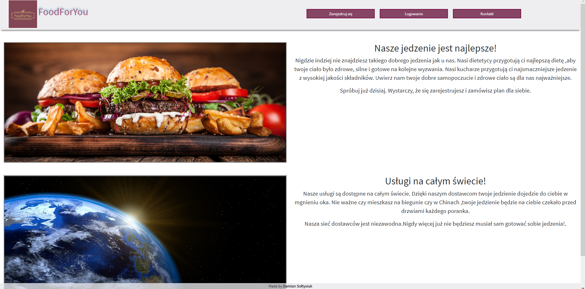
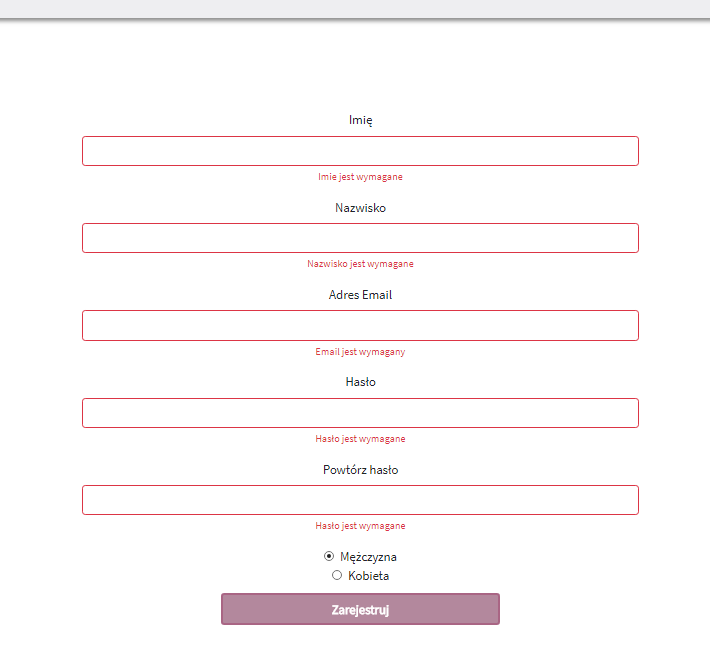
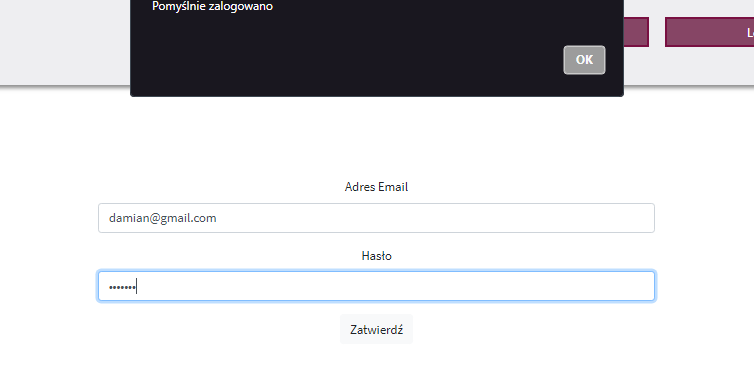
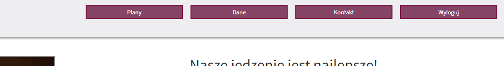
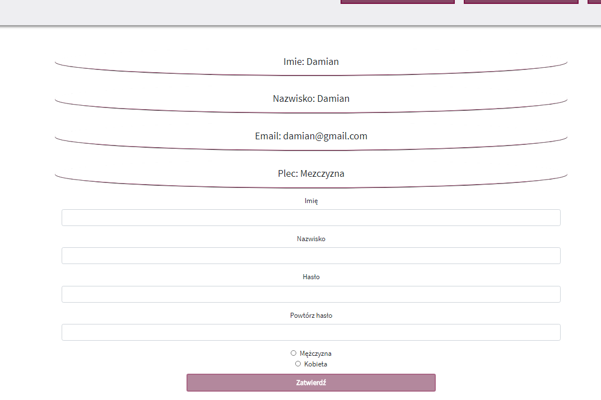
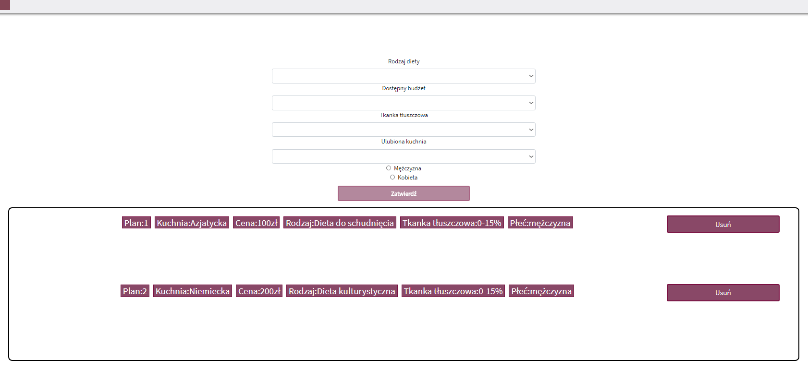
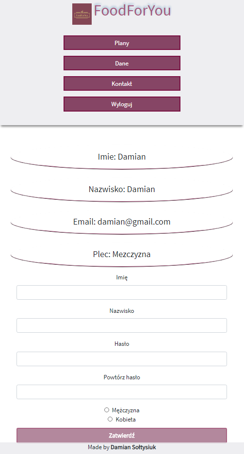

# CrudPhp

# Description

Jest to aplikacja typu CRUD zbudowana przy pomocy Angulara oraz PHP.

It is CRUD type application created with the help of Angular and PHP.In this application you can register and login.Also you can change your account infomation and add/delete plans.

This project was generated with [Angular CLI](https://github.com/angular/angular-cli) version 7.1.3.

# Design( old and bad :) )
<h2>1. Home page</h2>

<h2>2. Register form</h2>

<h2>3. Login form</h2>

<h2>4. Logged user menu</h2>

<h2>5. User data</h2>

<h2>6. Plans</h2>

<h2>7. RWD example</h2>

## Development server

Run `ng serve` for a dev server. Navigate to `http://localhost:4200/`. The app will automatically reload if you change any of the source files.

## Code scaffolding

Run `ng generate component component-name` to generate a new component. You can also use `ng generate directive|pipe|service|class|guard|interface|enum|module`.

## Build

Run `ng build` to build the project. The build artifacts will be stored in the `dist/` directory. Use the `--prod` flag for a production build.

## Running unit tests

Run `ng test` to execute the unit tests via [Karma](https://karma-runner.github.io).

## Running end-to-end tests

Run `ng e2e` to execute the end-to-end tests via [Protractor](http://www.protractortest.org/).

## Further help

To get more help on the Angular CLI use `ng help` or go check out the [Angular CLI README](https://github.com/angular/angular-cli/blob/master/README.md).
